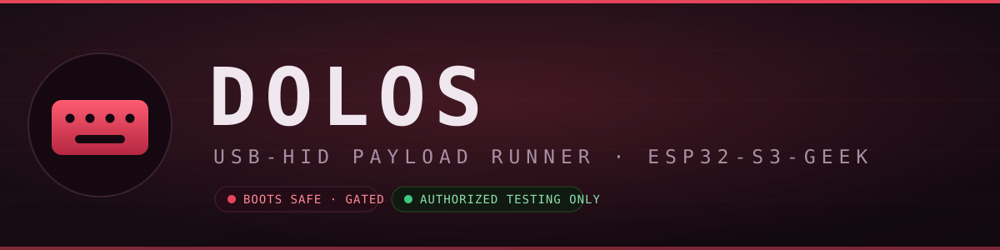
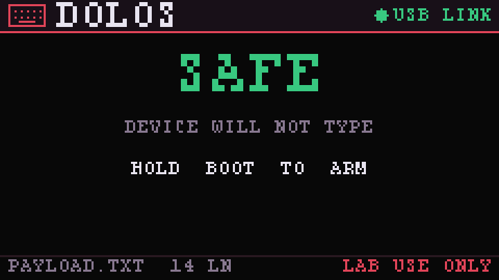
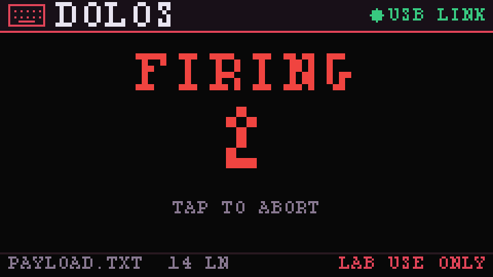
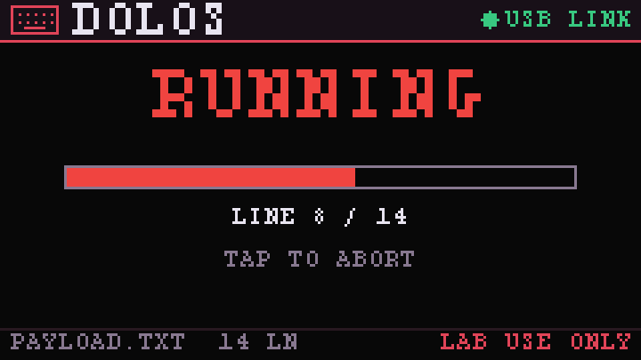
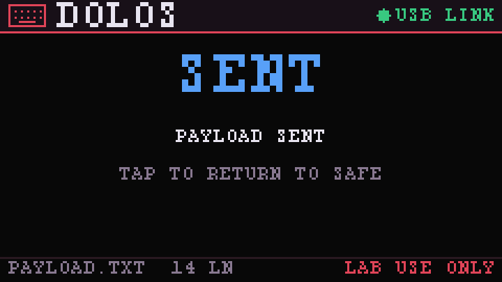

<p align="center">
  
</p>

<p align="center">
  <a href="https://github.com/at0m-b0mb/Dolos-ESP32-S3-GEEK/actions/workflows/host-tests.yml"></a>
  
  
  
  
</p>

<h1 align="center">Dolos</h1>

<p align="center"><b>A safety-gated USB-HID (BadUSB) payload runner with an on-screen mission control, for the Waveshare ESP32-S3-GEEK.</b><br>
<i>Built for authorized security professionals doing legal, consented testing.</i></p>

<p align="center">
  🔌 <a href="https://at0m-b0mb.github.io/Dolos-ESP32-S3-GEEK/"><b>Flash it from your browser</b></a> &nbsp;·&nbsp; no toolchain, no drivers
</p>

---

> [!WARNING]
> ## ⚖️ Ethics & Legal
> Dolos emulates a **USB keyboard**. Injecting keystrokes into a computer you do **not** own or have **explicit written authorization** to test is a crime in most jurisdictions (computer-misuse / unauthorized-access statutes such as the US CFAA, UK Computer Misuse Act, and equivalents worldwide).
>
> **Use Dolos only:** on your own equipment, in a lab you control, or under a signed engagement/scope that authorizes physical + HID testing. Keep the authorization in writing. **You are solely responsible for how you use this tool.** The authors provide it for education and authorized assessment and disclaim liability for misuse.
>
> Dolos is deliberately built to make *accidental* or *covert* firing hard — see [Safety model](#-safety-model). That is a floor, not a substitute for authorization.

---

## Why Dolos

The GEEK's USB-A plug goes straight into a host, and the ESP32-S3 has native USB — so this little board *is* a keyboard the moment you plug it in. Most BadUSB devices are **blind**: you trust that the payload ran. Dolos gives it a **1.14″ screen** and a **safety state machine**, so you always see exactly what it's doing and it never types until you decide.

|  | Dolos |
|---|---|
| **Payload language** | DuckyScript-style — `STRING`, `DELAY`, `GUI/CTRL/ALT/SHIFT` combos, F-keys, arrows, `REPEAT`, `DEFAULTDELAY` |
| **Payload source** | Plain-text `PAYLOAD.TXT` on microSD (readable, auditable) — or a harmless built-in demo |
| **On-screen mission control** | Live `SAFE → ARMED → FIRING → RUNNING → SENT` with per-line progress |
| **Arming** | Two deliberate BOOT-button holds + a 3-2-1 countdown; tap aborts anytime |
| **Flash-mode escape hatch** | Hold BOOT while plugging in → USB-HID never starts (stays serial, safe to re-flash) |
| **Tested** | Pure-C engine with **42 host unit tests**; UI verified never to draw off-panel |

<p align="center">
  
  
</p>
<p align="center">
  
  
</p>
<p align="center"><sub>The on-screen UI, rendered by the actual firmware UI code (240×135).</sub></p>

## 🛡 Safety model

Dolos is engineered so it will **not** fire by accident and **cannot** fire covertly without physical interaction at the device:

1. **Boots SAFE.** It enumerates as a keyboard that sends *nothing*. The screen says so in green.
2. **Two-stage arming.** `SAFE ──hold BOOT──▶ ARMED ──hold BOOT──▶ 3·2·1 countdown ──▶ RUNNING`. A **tap aborts** at any stage, and **ARMED times out** back to SAFE on its own.
3. **Flash mode.** Hold BOOT *while plugging in* and USB-HID never initializes — the device stays a plain serial port that can never type and is trivial to re-flash.
4. **Readable payloads.** The payload is plain text on the SD card. No hidden embedded payload; with no card, a harmless demo that only types a banner runs.
5. **Always-on reminder.** `LAB USE ONLY` never leaves the screen.

## ⌨️ DuckyScript reference

Drop a file named `PAYLOAD.TXT` in the root of a FAT-formatted microSD:

```text
REM  Comment - ignored (so is a line starting with #)
DEFAULTDELAY 40           REM  ms to wait between every command
DELAY 500                 REM  wait 500 ms once
STRING Hello, world!      REM  type literal text (case + symbols preserved)
STRINGLN done             REM  type text then press ENTER
ENTER                     REM  a named key on its own
GUI r                     REM  modifier + key  (Win/Cmd + R)
CTRL ALT DELETE           REM  fold multiple modifiers
REPEAT 3                  REM  repeat the previous command 3 more times
```

**Modifiers:** `CTRL`/`CONTROL`, `ALT`, `SHIFT`, `GUI`/`WINDOWS`/`COMMAND`.
**Named keys:** `ENTER` `ESC` `TAB` `SPACE` `BACKSPACE` `DELETE` `INSERT` `HOME` `END` `PAGEUP` `PAGEDOWN` `UP` `DOWN` `LEFT` `RIGHT` `CAPSLOCK` `MENU` `PRINTSCREEN` `F1`–`F12`.

> Layout is US-QWERTY today. International keyboard-layout profiles are on the [roadmap](#-roadmap).

## 🚀 Flash it

**Easiest — browser flasher:** open **<https://at0m-b0mb.github.io/Dolos-ESP32-S3-GEEK/>** in Chrome/Edge, tick the authorization box, click *Install Dolos*, pick the port. Done.

**From source:**

```bash
. $IDF_PATH/export.sh
idf.py set-target esp32s3
idf.py build flash          # first flash: board is still a serial device
```

Because Dolos becomes a **keyboard** after boot, its serial port disappears. To re-flash, **hold BOOT while plugging in** (FLASH MODE keeps it serial), then `idf.py flash`.

## 🧠 Architecture

```
components/ducky/     Pure-C DuckyScript engine + US HID keymap   (host-tested)
components/ui/         Canvas + 5×8 font + mission-control UI       (host-tested)
main/usb_hid.c         TinyUSB HID keyboard device + descriptors
main/payload.c         SD payload loader + player (honors abort)
main/dolos_main.c      Safety state machine + BOOT-button control
main/display.c         ST7789 1.14" LCD driver
test/host/             42 unit tests — build & run with `make -C test/host`
```

The engine has **zero hardware dependencies**, so the whole keymap + parser is exercised on a laptop before it ever drives a real keyboard:

```bash
make -C test/host        # keymap: 20 checks · ducky: 22 checks · ui: 7 checks
```

## 🗺 Roadmap

Dolos is built to grow into a professional, enterprise-grade authorized-testing tool. Planned:

- ⚡ **Faster injection** — 1 ms USB polling + configurable speed profiles (fast / balanced / reliable)
- 🌍 **Keyboard-layout profiles** — US / UK / DE / FR / ES …
- 🗂 **Multi-payload picker** — choose among many payloads on the SD card, on-screen
- 🖥 **Target-OS profiles** — Windows / macOS / Linux key handling
- 👁 **Dry-run mode** — preview keystrokes on the LCD without sending (authorized demos)
- 📝 **Engagement audit log** — every run recorded to SD (payload, line count, aborted?) for accountability
- 🔒 **On-device PIN arming** — a code to arm, so a lost device can't be misused
- 🖱 **Extended HID** — media keys + mouse (jiggler / positioning)

See [Issues](https://github.com/at0m-b0mb/Dolos-ESP32-S3-GEEK/issues) to propose or prioritize.

## 📟 Hardware

| | |
|---|---|
| **Board** | Waveshare ESP32-S3-GEEK (ESP32-S3, 16 MB flash, 2 MB PSRAM) |
| **Display** | 1.14″ ST7789, 240×135 |
| **Input** | BOOT button (the single, deliberate control) |
| **Storage** | microSD (TF) for payloads |
| **USB** | USB-A plug → native USB, enumerates as an HID keyboard |

## License

MIT © [at0m-b0mb](https://github.com/at0m-b0mb). Provided for education and **authorized** security testing. No warranty; use responsibly and legally.
